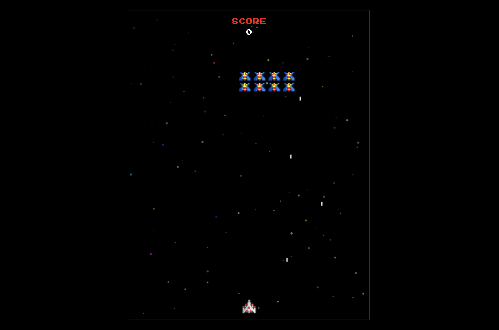
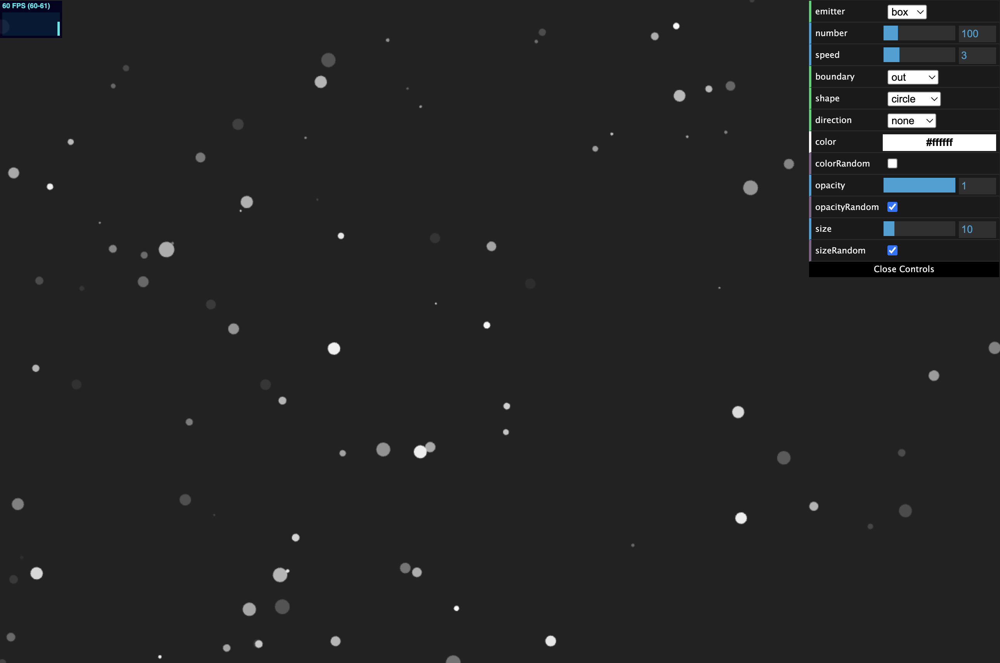
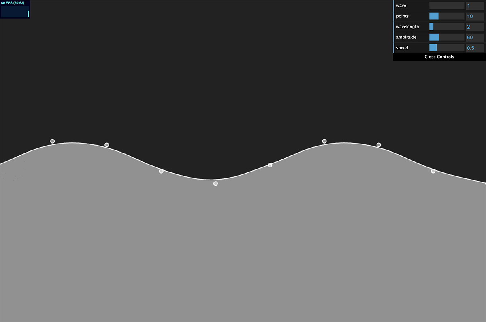
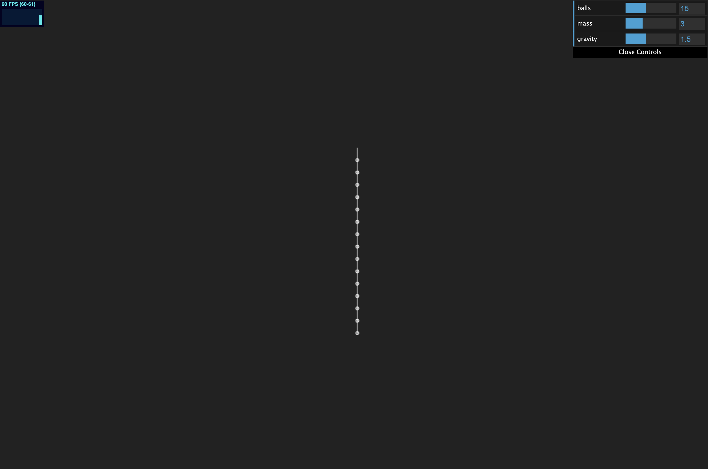
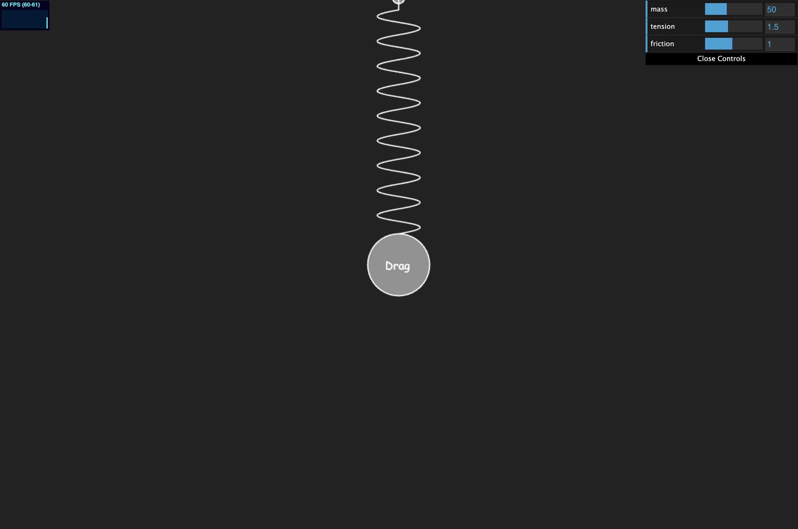
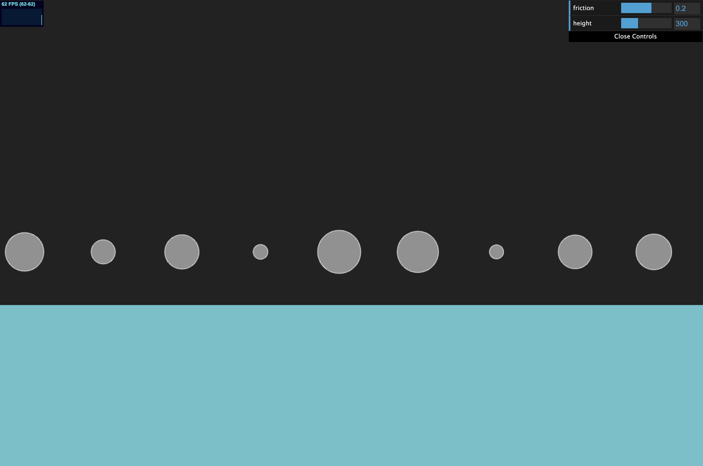
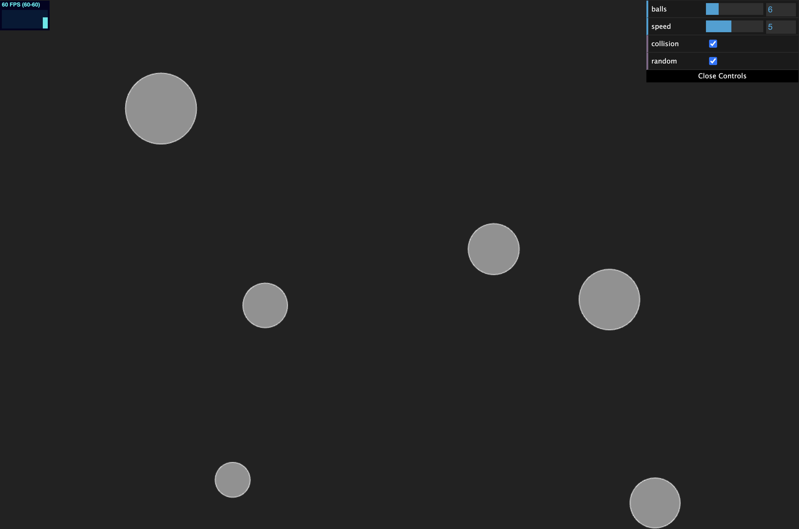

# 개인작업물

### Galaga

> 갤러그 게임 구현

* [demo] <https://racodin.github.io/kimsunkyu/galaga/index.html>  
* [code] <https://github.com/racodin/kimsunkyu/tree/master/galaga>
***
### Particle

> 파티클 구현

* [demo] <https://racodin.github.io/kimsunkyu/particle/index.html>  
* [code] <https://github.com/racodin/kimsunkyu/tree/master/particle>
***
### Wave

> 파도 물결 구현

* [demo] <https://racodin.github.io/kimsunkyu/wave/index.html>  
* [code] <https://github.com/racodin/kimsunkyu/tree/master/wave>
***
### Chain

> 체인 구현

* [demo] <https://racodin.github.io/kimsunkyu/chain/index.html>  
* [code] <https://github.com/racodin/kimsunkyu/tree/master/chain>
***
### Spring

> 스프링 구현

* [demo] <https://racodin.github.io/kimsunkyu/spring/index.html>  
* [code] <https://github.com/racodin/kimsunkyu/tree/master/spring>
***
### Force

> 물리 구현

* [demo] <https://racodin.github.io/kimsunkyu/force/index.html>  
* [code] <https://github.com/racodin/kimsunkyu/tree/master/force>
***
### Collision

> 벡터를 활용한 충돌 감지

* [demo] <https://racodin.github.io/kimsunkyu/collision/index.html>  
* [code] <https://github.com/racodin/kimsunkyu/tree/master/collision>
